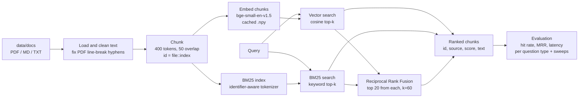

# Hybrid Search: Vector vs BM25 vs Reciprocal Rank Fusion

A Python retrieval system that searches a collection of research papers (PDF, Markdown, text) in three ways and measures which works best for which kind of question. Documents are split into overlapping, token-sized chunks with stable IDs, then indexed twice: as dense embeddings (`BAAI/bge-small-en-v1.5`, cosine similarity in NumPy) for meaning-based search, and with BM25 for exact keyword search. A hybrid mode merges both rankings using Reciprocal Rank Fusion, implemented from scratch. A gold-labelled evaluation pipeline compares the modes by hit rate, MRR and latency, broken down by question type (exact terms, paraphrases, natural questions), and runs sweeps over fusion settings and chunk size. The scope is retrieval only, with no LLM generation, so search quality is measured on its own. *Status: in progress. The evaluation question set is under review.*

## How it works



## How to run

Requires Python 3.11+.

```bash
pip install -r requirements.txt

# 1. Build the index (the first run downloads the embedding model; later runs reuse cached embeddings)
python -m search.index

# 2. Search in any mode: vector | bm25 | hybrid
python -m search.query --mode hybrid --q "How are American options priced under stochastic correlation?"

# 3. Evaluate all three modes on eval/questions.json
#    Writes eval/results.md, eval/analysis.md and eval/results.jsonl
python -m eval.run_eval

# 4. Run the tests
pytest
```

Put your own documents in `data/docs/` and re-run step 1. Chunking and fusion settings live in `config.py`.

## Project layout

| Path | Purpose |
|---|---|
| `config.py` | Chunk size, overlap, model name, fusion settings (with trade-off notes) |
| `search/` | Loading, chunking, BM25 tokenizer, RRF fusion, indexing, retrieval, CLI |
| `eval/` | Evaluation runner, metrics, win/loss analysis, question set |
| `tests/` | Fusion, chunk-ID stability, retrieval modes, metrics |
